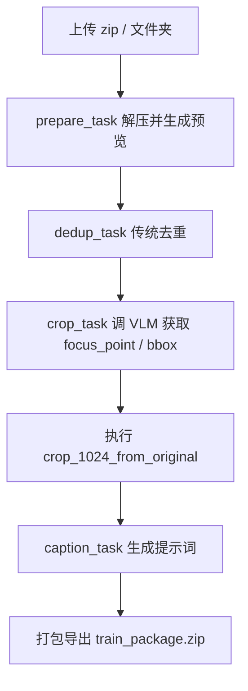
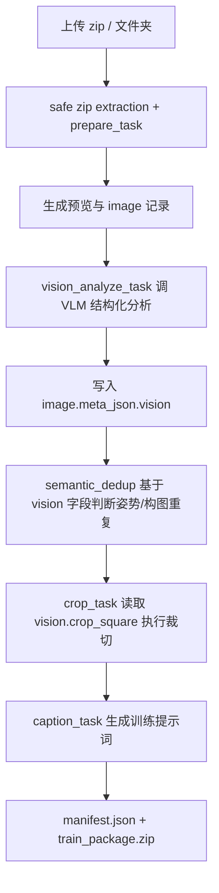
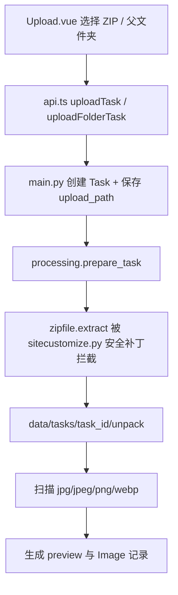

# Image Tagging WebUI 项目现状与 Agent 交接文档

分支：`refactor/vision-analysis-schema`

本文档用于记录当前项目目标、目录结构、数据流、正在实现的重构方向、TODO，以及交给后续 Agent / Codex / 本地模型继续维护时使用的提示词。任何后续修改都应同步维护本文档、`docs/VISION_ANALYSIS_REFACTOR_TODO.md`、`docs/FRONTEND_REVIEW_NOTES.md` 与 `docs/DEVELOPMENT_CHANGELOG.md`。

---

## 0. 当前最重要结论

当前分支已经完成了很多“基础设施”：provider 管理器、后端本地密钥保存、VLM 结构化分析 client、vision metadata 类型、semantic dedup helper、ZIP 安全解压补丁、日志乱码显示修复、前端图片字段归一化。

但是，**主处理链路还没有真正切换到一次 VLM 结构化视觉分析**。

所以如果现在用户看到：

```text
占比: -
人脸: 无
可用: 是
```

不要继续把它当作最终结果调参。这只是旧链路 `dedup_people.py` / 传统 CV 字段的表现。真实目标是：

```text
prepare -> vision_analyze -> semantic_dedup -> crop -> caption
```

其中 `vision_analyze` 应该一次模型调用产出：裁切框、主体框、头部/脸部可见性、姿势、构图、景别、表情、遮挡、环境、训练价值、可用性、置信度和原因。

---

## 1. 项目目标

本项目是一个面向 LoRA / SD / 人像写真 / coser 数据集构建的 WebUI 工具。它的目标不是做复杂的传统 CV 研究，而是提供一个实用的图片数据集整理流水线：

1. 上传压缩包或文件夹；
2. 安全解压并生成预览；
3. 用 VLM 分析图片主体、裁切框、姿势、景别、表情、遮挡、场景、主色调与训练价值；
4. 基于结构化视觉元数据去掉重复或姿势/构图过近的图片；
5. 生成统一尺寸裁切图；
6. 生成训练提示词；
7. 打包导出训练集。

当前重构的核心理念：

> 把“裁切坐标输出”升级为“结构化视觉分析”。VLM 负责看图并输出严格 JSON；后端负责 provider 配置、调用模型、校验 JSON、缓存元数据、规则去重、裁切执行和打包；前端负责选择、预览、审查和调试。

---

## 2. 当前技术栈

```text
frontend/      Vue 3 + TypeScript + Vite + Element Plus
backend/       Python FastAPI + SQLAlchemy + Pillow + OpenAI-compatible SDK
config/        端口、静态模型 provider 配置
docs/          项目文档、重构 TODO、Agent 交接文档
.github/       GitHub Actions 基础 CI
```

重要说明：

- 该项目不是 Java 项目；后端是 Python FastAPI。
- 后端职责类似 Java/Spring Boot 后端：任务编排、配置管理、数据库、模型调用、状态机、接口返回。
- 图像处理和模型调用继续保留 Python 更合适。

---

## 3. 当前目录结构

```text
image-tagging-webui/
├─ backend/
│  ├─ app/
│  │  ├─ api/
│  │  │  └─ endpoints/
│  │  │     └─ models.py                  # /api/models 与 provider 管理接口
│  │  ├─ core/
│  │  │  ├─ config.py                     # 全局 settings
│  │  │  ├─ defaults.py                   # 默认提示词 / 去重参数等
│  │  │  └─ model_providers.py            # 后端模型 provider 注册表，合并静态 yml + runtime provider
│  │  ├─ models/
│  │  │  ├─ image.py                      # 图片记录模型
│  │  │  ├─ log.py                        # 日志模型；已加入已知 mojibake 片段写入修复
│  │  │  └─ task.py                       # 任务模型；已新增 vision_analysis 阶段枚举
│  │  ├─ services/
│  │  │  ├─ app_settings.py               # 应用设置：caption prompt / dedup / crop size
│  │  │  ├─ dedup_people.py               # 旧去重：InsightFace + MediaPipe + SSIM，暂作 fallback
│  │  │  ├─ image_processing.py           # 预览、裁切等图像处理
│  │  │  ├─ model_client.py               # 模型调用；已新增 analyze_image()
│  │  │  ├─ provider_runtime_config.py    # 后端本地保存 provider、Base URL、API Key、模型列表
│  │  │  ├─ semantic_dedup.py             # 结构化 vision 元数据相似度打分
│  │  │  └─ vision_metadata.py            # vision JSON 归一化与 focus 兼容转换
│  │  ├─ tasks/
│  │  │  ├─ celery_app.py
│  │  │  └─ processing.py                 # 主流水线；仍待接入 vision_analyze_task
│  │  └─ main.py                          # FastAPI 主入口；仍待接入 /analyze 接口
│  ├─ requirements.txt                    # 已加入 PyYAML
│  └─ sitecustomize.py                    # ZIP 安全解压补丁
│
├─ config/
│  ├─ ports.json
│  └─ model_providers.yml                 # 静态 provider 配置与默认模型
│
├─ frontend/
│  ├─ src/
│  │  ├─ components/
│  │  │  └─ ApiSettings.vue               # 模型供应商管理器：添加/编辑/删除/测试 provider
│  │  ├─ services/
│  │  │  └─ api.ts                        # provider API + 任务 API；已做 log 修复和 TaskImage 归一化
│  │  ├─ types/
│  │  │  └─ task.ts                       # VisionMetadata 类型
│  │  └─ views/
│  │     ├─ Upload.vue                    # 待进一步修复 zip 过滤/重复队列/上传提示
│  │     └─ TaskList.vue                  # 待接入 Analyze 按钮、vision 展示、错误兜底
│  └─ package.json
│
├─ docs/
│  ├─ DEVELOPMENT_CHANGELOG.md            # 近期调试记录
│  ├─ FRONTEND_REVIEW_NOTES.md            # 前端审查记录
│  ├─ VISION_ANALYSIS_REFACTOR_TODO.md    # 细化重构 TODO
│  └─ PROJECT_STATUS_AND_AGENT_HANDOFF.md # 当前文档
│
└─ .github/
   └─ workflows/
      └─ ci.yml                           # 前端 build + 后端 smoke checks + zip smoke test
```

运行时本地文件：

```text
backend/data/runtime/model_provider_secrets.json
```

该文件由前端“模型服务”页面保存到后端本地，包含 API Key 等敏感配置。它位于 `backend/data/` 下，不应提交到 Git。

---

## 4. 旧数据流

旧流程大致是：



旧流程的问题：

1. VLM 只在裁切阶段输出裁切相关字段；
2. 姿势检测来自 `dedup_people.py` 的 MediaPipe Pose，主要作为去重辅助；
3. 传统 CV 经常出现 `face_conf=0`，不能可靠代表“没有脸”；
4. 视觉理解结果和裁切逻辑混在 `crop_task()` 里；
5. provider 和模型列表原本硬编码，不利于切换 ModelScope / 阿里云 / OpenAI-compatible 服务；
6. ZIP 解压曾直接依赖 `zipfile.extract()`，路径安全与中文 Windows ZIP 文件名兼容不足。

---

## 5. 新目标数据流

目标流程：



结构化视觉分析返回：

```json
{
  "subject_bbox": {"x1": 0.1, "y1": 0.05, "x2": 0.85, "y2": 0.98},
  "head_bbox": {"x1": 0.36, "y1": 0.08, "x2": 0.56, "y2": 0.28},
  "crop_square": {"cx": 0.48, "cy": 0.52, "side": 0.94},
  "shot_type": "full_body",
  "body_visibility": "full_body",
  "view_angle": "front",
  "camera_angle": "eye_level",
  "pose_family": "standing",
  "pose_signature": {
    "torso_direction": "front",
    "head_direction": "front",
    "left_arm": "down",
    "right_arm": "near_face",
    "left_leg": "straight",
    "right_leg": "bent",
    "prop_interaction": "none"
  },
  "expression": "calm",
  "face_occlusion": "none",
  "body_occlusion": "none",
  "environment": "outdoor",
  "dominant_colors": ["white", "blue", "gold"],
  "skin_exposure_level": "medium",
  "outfit_coverage": "partial",
  "training_value": "high",
  "usable": true,
  "confidence": 0.84,
  "reason": "clear full-body cosplay image with useful pose diversity"
}
```

---

## 6. 模型 provider 数据流

```mermaid
flowchart TD
    A[config/model_providers.yml 静态配置] --> C[model_providers.py]
    B[backend/data/runtime/model_provider_secrets.json 本地运行时配置] --> C
    C --> D[/api/models]
    D --> E[前端模型供应商管理器]
    E --> F[POST runtime-config 保存 Base URL/API Key/模型列表]
    E --> G[POST provider test 测试连通性]
    C --> H[ModelClient.from_provider]
    H --> I[OpenAI-compatible Chat Completions]
```

当前已实现：

- `config/model_providers.yml`
- `backend/app/core/model_providers.py`
- `backend/app/services/provider_runtime_config.py`
- `/api/models` provider-driven response
- `POST /api/models/providers` 创建自定义供应商
- `DELETE /api/models/providers/{provider_id}` 删除 runtime provider
- `GET/POST /api/models/providers/{provider_id}/runtime-config` 读取/保存后端本地配置
- `POST /api/models/providers/{provider_id}/test` 测试连通性
- 前端“模型服务”页面改为 provider manager 风格 UI
- 收藏模型刷新后仍保留，保存模型 id + label/tasks，而不是只保存 id

注意：

- API Key 可以从前端输入，但只提交给后端保存；不放 localStorage；不提交 Git；接口只返回 masked key。
- 静态 provider 与 runtime provider 会合并显示。
- 动态模型列表使用 OpenAI-compatible `GET {base_url}/{model_list_path}`，失败则保留静态/手动模型列表。

仍待完成：

- 后端 task 创建接口仍保留 `api_key/base_url` 参数，需要清理；
- 任务应显式保存 `provider`，目前主要仍依赖 `focus_model/tag_model`；
- `ModelClient.from_provider()` 已有，但主流程还没全面使用。

---

## 7. 上传 / ZIP 数据流

当前上传入口：



已修：

- `backend/sitecustomize.py` 对 ZIP 解压做安全补丁；
- 拒绝 `../evil.jpg`、绝对路径、Windows 盘符路径；
- 标准化混合斜杠与 Windows 非法路径字符；
- 对老 Windows 中文 ZIP 文件名做 GBK 恢复尝试；
- CI 增加 safe ZIP smoke test。

仍待修：

- `Upload.vue` 需要过滤非 zip 文件；
- `Upload.vue` 需要避免同一个 zip 重复入队；
- 后端应对空 zip、坏 zip、无图片 zip 给出更明确的错误；
- 后续重构 `processing.py` 时，应把 runtime monkey patch 替换成显式 `safe_extract_zip()` helper。

---

## 8. 当前已完成列表

### 后端模型配置 / provider manager

- [x] 新增 `config/model_providers.yml`
- [x] 新增 `backend/app/core/model_providers.py`
- [x] 默认 provider 设为 `aliyun_dashscope`
- [x] 保留 `modelscope` provider
- [x] 支持可选 `openai_compatible` provider
- [x] 支持 runtime-only 自定义 provider
- [x] API Key 可由前端提交给后端本地保存
- [x] API Key 不回显完整值，不写入 Git
- [x] `/api/models` 返回 provider 列表、模型列表、configured 状态
- [x] 支持 provider 连通性测试

### 视觉分析基础设施

- [x] `ModelClient.analyze_image()`
- [x] 结构化视觉分析 Prompt
- [x] 坐标 / bbox / crop_square 归一化
- [x] `get_focus_point()` 兼容旧流程
- [x] `vision_metadata.py`
- [x] `semantic_dedup.py`
- [x] 前端 `TaskImage` 支持 `VisionMetadata`
- [x] 前端 `getTaskImages()` 会优先合并 `meta_json.vision` 字段

### 上传/解压

- [x] `backend/sitecustomize.py` 安全 ZIP 解压补丁
- [x] safe ZIP CI smoke test

### 前端

- [x] `ApiSettings.vue` 变为模型供应商管理器
- [x] `api.ts` 增加 provider create/delete/runtime-config/test API client
- [x] `api.ts` 不再把模型密钥附加到上传/任务请求里
- [x] `api.ts` 修复已知日志 mojibake 显示
- [x] `ApiSettings.vue` 修复模型列表 tab 点击刷新/闪退
- [x] `ApiSettings.vue` 修复模型收藏刷新丢失
- [x] `task.ts` 增加 `VisionMetadata` 类型

### CI / 文档

- [x] 新增 `.github/workflows/ci.yml`
- [x] 前端 build 检查
- [x] 后端 compileall 检查
- [x] provider 配置 smoke test
- [x] vision normalization / semantic similarity smoke test
- [x] safe zip extraction smoke test
- [x] 新增 `docs/VISION_ANALYSIS_REFACTOR_TODO.md`
- [x] 新增 `docs/FRONTEND_REVIEW_NOTES.md`
- [x] 新增 `docs/DEVELOPMENT_CHANGELOG.md`
- [x] 新增当前交接文档

---

## 9. 正在实现中

当前分支还不是可合并主线状态。正在实现的主线任务：

```text
P1: 把 vision analysis 真正接入任务流水线
P0: 稳定当前前端详情页和日志显示
P0.5: 把上传/ZIP 处理从补丁式修复收口为显式安全 helper
```

具体包括：

- [ ] 在 `processing.py` 添加 `vision_analyze_task(task_id, auto_continue=False)`；
- [ ] `vision_analyze_task` 调用 `ModelClient.from_provider(...).analyze_image(...)`；
- [ ] 将结果写入 `image.meta_json["vision"]`；
- [ ] 同步写入 `crop_square_model`、`focus`、`quality`、`subject_area_ratio`；
- [ ] 在 `main.py` 添加 `POST /api/tasks/{task_id}/analyze`；
- [ ] 在 `run_full_pipeline()` 中加入 `vision_analyze_task`；
- [ ] 修改 `crop_task()`，优先读取 `image.meta_json["vision"]["crop_square"]`；
- [ ] 修改 `_image_summary()`，返回 `vision` 字段给前端；
- [ ] 后端任务创建应保存 provider id；
- [ ] `TaskList.vue` 增加详情页错误兜底，避免单个坏字段导致空白页；
- [ ] 后续将 `sitecustomize.py` 的 ZIP 安全逻辑移动到 `processing.py` 显式 helper。

---

## 10. TODO 优先级

### P0：安全与稳定收口

- [ ] 清理后端 task 创建接口里的 `api_key/base_url` 参数；
- [ ] 清理 `X-Ext-Api-Key`、`X-Ext-Base-Url`、`X-Ext-Models` header 覆盖逻辑；
- [ ] 为任务新增 provider 字段，或至少写入 `task.config["provider"]`；
- [ ] 保证旧任务不崩：旧 DB 中存在 `api_key/base_url` 字段可以保留，但新代码不再使用；
- [ ] 明确 README 或 docs 中的密钥安全说明：API Key 只允许保存到 ignored runtime file；
- [ ] 删除误提交的 `.vite/deps/*` 并加入 `.gitignore`。

### P1：视觉分析闭环

- [ ] `vision_analyze_task()`
- [ ] `/api/tasks/{id}/analyze`
- [ ] `run_full_pipeline()` 插入 vision analysis
- [ ] `crop_task()` 读取 vision crop
- [ ] `_image_summary()` 返回 vision
- [ ] 前端 TaskList 展示 vision 标签
- [ ] 把当前“去重结果”区分为 `传统去重结果` 与 `视觉分析结果`

### P2：语义去重闭环

- [ ] 新增 semantic dedup task 或整合到 dedup_task；
- [ ] 基于 `semantic_similarity()` 生成重复簇；
- [ ] 写入 `meta_json["semantic_dedup"]`；
- [ ] 每簇保留 2-3 张；
- [ ] 保留旧 `dedup_people.py` 作为 fallback / 预过滤。

### P3：前端调试与筛选

- [ ] 增加“视觉分析”按钮；
- [ ] 增加 vision 字段展示；
- [ ] 增加按 `shot_type`、`pose_family`、`environment`、`training_value` 筛选；
- [ ] 增加重复簇视图；
- [ ] 增加可解释的 `similarity_reasons` 展示；
- [ ] 修复 `Upload.vue` 剩余中文乱码；
- [ ] 修复 `TaskList.vue` stage filter / pagination；
- [ ] 修复/捕获详情页空白问题，优先查看浏览器控制台红色报错。

### P4：测试

- [ ] 添加 pytest；
- [ ] 添加 provider config 单元测试；
- [ ] 添加 vision JSON sanitization 单元测试；
- [ ] 添加 semantic dedup 单元测试；
- [ ] 添加更多 ZIP 边界测试，不把大图片塞进仓库；
- [ ] 添加前端 smoke checklist：模型服务页 tab、收藏刷新、任务详情打开、日志渲染。

---

## 11. 给后续 Agent 的提示词

把下面提示词交给后续 Agent / Codex / 本地模型继续实现：

```text
你正在维护 GitHub 仓库 cnlove7777777-art/image-tagging-webui，当前工作分支是 refactor/vision-analysis-schema。

项目目标：
这是一个面向 LoRA / SD / coser / 人像写真数据集构建的 WebUI 工具。目标不是做复杂传统 CV 研究，而是用 VLM 输出结构化视觉元数据，再由后端做校验、缓存、轻规则去重、裁切和打包。请始终围绕“实用的数据集构建工具”推进，不要把项目改成算法论文式工程。

当前技术栈：
- 后端：Python FastAPI + SQLAlchemy + Pillow + OpenAI-compatible SDK
- 前端：Vue 3 + TypeScript + Vite + Element Plus
- 静态配置：config/model_providers.yml
- 本地运行时配置：backend/data/runtime/model_provider_secrets.json
- 文档：docs/VISION_ANALYSIS_REFACTOR_TODO.md、docs/FRONTEND_REVIEW_NOTES.md、docs/DEVELOPMENT_CHANGELOG.md 和 docs/PROJECT_STATUS_AND_AGENT_HANDOFF.md

当前架构方向：
旧流程：prepare -> dedup_people traditional CV -> crop/VLM focus -> caption
目标流程：safe upload -> prepare -> vision_analyze -> semantic_dedup -> crop -> caption

关键原则：
1. API Key 可以从前端输入，但只能保存到后端 ignored runtime file，不得写入 Git，不得放 localStorage，不得完整回显。
2. 模型 provider 来自 config/model_providers.yml + backend/data/runtime/model_provider_secrets.json 的合并结果。
3. VLM 调用要输出严格 JSON，不要依赖自由文本描述。
4. 视觉分析结果统一写入 image.meta_json["vision"]。
5. 一次 vision analysis 应同时产出 crop_square、subject_bbox、head_bbox/face visibility、pose、composition、shot type、usable/training value、confidence/reason。
6. crop_task 应优先读取 vision.crop_square；只有没有 vision 时才 fallback 到旧 get_focus_point()。
7. 去重应保守，误删比多留更糟。semantic_similarity() 只作为“姿势/构图重复候选”的规则基础。
8. dedup_people.py 暂时不要删，可保留为传统 CV fallback / 预过滤，但不要把它当作最终视觉理解来源。
9. 修改 processing.py 和 main.py 要小步提交，不要一次整文件重写，因为它们包含上传、删除、SSE、任务状态和打包等旧逻辑。
10. 当前 backend/sitecustomize.py 是 ZIP 解压安全补丁，后续深改 processing.py 时应替换为显式 safe_extract_zip() helper。
11. 每次完成阶段性改动，都要更新 docs/VISION_ANALYSIS_REFACTOR_TODO.md、docs/FRONTEND_REVIEW_NOTES.md、docs/DEVELOPMENT_CHANGELOG.md 和 docs/PROJECT_STATUS_AND_AGENT_HANDOFF.md。
12. 每次修改后至少保证：前端 npm run build 能过，后端 python -m compileall app sitecustomize.py 能过，provider config smoke test 能过，zip smoke test 能过。

已经完成：
- config/model_providers.yml
- backend/app/core/model_providers.py
- backend/app/services/provider_runtime_config.py
- /api/models provider-driven
- provider create/delete/runtime-config/test endpoints
- ModelClient.analyze_image()
- vision_metadata.py
- semantic_dedup.py
- frontend ApiSettings.vue provider manager UI
- frontend api.ts provider management client
- frontend api.ts log repair + TaskImage normalization
- frontend task.ts VisionMetadata
- backend app/models/log.py known mojibake repair on write
- backend/sitecustomize.py safe zip extraction patch
- CI smoke tests

下一步优先任务：
1. 在 backend/app/tasks/processing.py 中新增 vision_analyze_task(task_id, auto_continue=False)。
2. 在 backend/app/main.py 中新增 POST /api/tasks/{task_id}/analyze。
3. 修改 crop_task，使其优先读取 image.meta_json["vision"]["crop_square"]。
4. 修改 _image_summary，返回 vision 字段。
5. 后端 task 创建接口移除 API key/base URL/header override，改为 provider 后端配置。
6. 前端 TaskList.vue 展示 vision 元数据，并增加 Analyze 按钮。
7. 接入 semantic_similarity，生成 semantic_dedup cluster。
8. 把 ZIP 解压逻辑从 sitecustomize.py 迁移为 processing.py 中显式 helper。
9. 修复 Upload.vue 非 zip 过滤、重复入队、中文乱码提示。
10. 如果“查看详情”仍空白，先查看浏览器控制台红色报错，再加前端兜底。

不要声称已经跑通过完整项目，除非实际运行了 CI 或本地测试。若不能运行，也要明确说明只做了静态检查和 smoke test。
```

---

## 12. 维护约定

后续每次改动都应同时维护：

1. `docs/VISION_ANALYSIS_REFACTOR_TODO.md`：打勾或新增 TODO；
2. `docs/FRONTEND_REVIEW_NOTES.md`：前端结构/问题变化时更新；
3. `docs/DEVELOPMENT_CHANGELOG.md`：记录近期调试坑和修复原因；
4. `docs/PROJECT_STATUS_AND_AGENT_HANDOFF.md`：当结构、流程、关键文件变化时更新；
5. CI：不能让 smoke test 长期失败；
6. 不要提交真实 API Key；
7. 不要提交 `backend/data/runtime/model_provider_secrets.json`；
8. 后端不要把模型密钥写入任务记录或完整返回给前端。

---

## 13. 当前合并状态

当前分支是部分重构分支：

```text
refactor/vision-analysis-schema
```

不要直接合并到 `main`，直到以下条件满足：

- [ ] `vision_analyze_task` 已接入；
- [ ] `/analyze` 接口可用；
- [ ] `run_full_pipeline()` 包含 vision analysis；
- [ ] `crop_task` 可读取 `vision.crop_square`；
- [ ] 前端能展示 vision 字段；
- [ ] provider manager 通过本地手动测试；
- [ ] ZIP 上传至少手动测试：正常中文 zip、空 zip、坏 zip、路径穿越 zip；
- [ ] CI 通过；
- [ ] 至少手动跑通一次小图片包：上传 -> 分析 -> 去重 -> 裁切 -> caption -> 打包。
