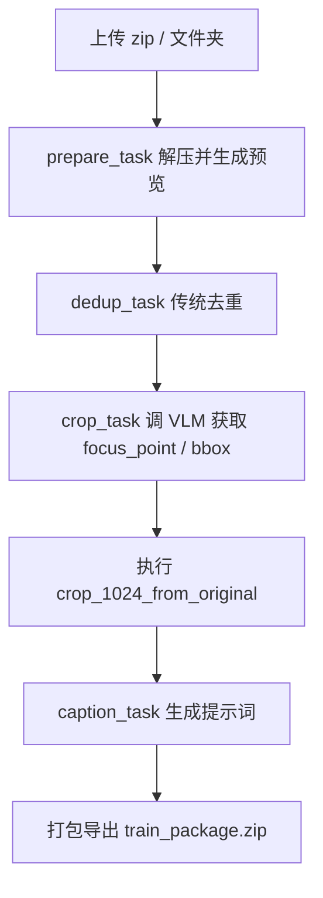
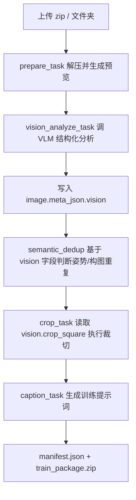

# Image Tagging WebUI 项目现状与 Agent 交接文档

分支：`refactor/vision-analysis-schema`

本文档用于记录当前项目目标、目录结构、数据流、正在实现的重构方向、TODO，以及交给后续 Agent / Codex / 本地模型继续维护时使用的提示词。任何后续修改都应同步维护本文档与 `docs/VISION_ANALYSIS_REFACTOR_TODO.md`。

---

## 1. 项目目标

本项目是一个面向 LoRA / SD / 人像写真 / coser 数据集构建的 WebUI 工具。它的目标不是做复杂的传统 CV 研究，而是提供一个实用的图片数据集整理流水线：

1. 上传压缩包或文件夹；
2. 解压并生成预览；
3. 分析图片主体、裁切框、姿势、景别、表情、遮挡、场景、主色调与训练价值；
4. 去掉重复或姿势/构图过近的图片；
5. 生成统一尺寸裁切图；
6. 生成训练提示词；
7. 打包导出训练集。

当前重构的核心理念：

> 把“裁切坐标输出”升级为“结构化视觉分析”。VLM 负责看图并输出 JSON；后端负责 provider 配置、调用模型、校验 JSON、缓存元数据、规则去重、裁切执行和打包；前端负责选择、预览、审查和调试。

---

## 2. 当前技术栈

```text
frontend/      Vue 3 + TypeScript + Vite + Element Plus
backend/       Python FastAPI + SQLAlchemy + Pillow + OpenAI-compatible SDK
config/        后端端口、模型 provider 配置
docs/          项目文档、重构 TODO、Agent 交接文档
.github/       GitHub Actions 基础 CI
```

重要说明：

- 该项目不是 Java 项目；后端是 Python FastAPI。
- 后端职责类似 Java/Spring Boot 后端：任务编排、配置管理、数据库、模型调用、状态机、接口返回。
- 图像处理和模型调用继续保留 Python 更合适。

---

## 3. 当前目录结构

```text
image-tagging-webui/
├─ backend/
│  ├─ app/
│  │  ├─ api/
│  │  │  └─ endpoints/
│  │  │     └─ models.py                  # /api/models，已改为 provider 配置驱动
│  │  ├─ core/
│  │  │  ├─ config.py                     # 全局 settings
│  │  │  ├─ defaults.py                   # 默认提示词 / 去重参数等
│  │  │  └─ model_providers.py            # 新增：后端模型 provider 注册表
│  │  ├─ models/
│  │  │  ├─ image.py                      # 图片记录模型
│  │  │  ├─ log.py                        # 日志模型
│  │  │  └─ task.py                       # 任务模型；已新增 vision_analysis 阶段枚举
│  │  ├─ services/
│  │  │  ├─ app_settings.py               # 应用设置：caption prompt / dedup / crop size
│  │  │  ├─ dedup_people.py               # 旧去重：InsightFace + MediaPipe + SSIM，暂作 fallback
│  │  │  ├─ image_processing.py           # 预览、裁切等图像处理
│  │  │  ├─ model_client.py               # 模型调用；已新增 analyze_image()
│  │  │  ├─ semantic_dedup.py             # 新增：结构化 vision 元数据相似度打分
│  │  │  └─ vision_metadata.py            # 新增：vision JSON 归一化与 focus 兼容转换
│  │  ├─ tasks/
│  │  │  ├─ celery_app.py
│  │  │  └─ processing.py                 # 主流水线；仍待接入 vision_analyze_task
│  │  └─ main.py                          # FastAPI 主入口；仍待接入 /analyze 接口
│  └─ requirements.txt                    # 已加入 PyYAML
│
├─ config/
│  ├─ ports.json
│  └─ model_providers.yml                 # 新增：后端模型 provider 配置
│
├─ frontend/
│  ├─ src/
│  │  ├─ components/
│  │  │  └─ ApiSettings.vue               # 已移除前端 API Key / Base URL 设置
│  │  ├─ services/
│  │  │  └─ api.ts                        # 已停止从前端发送 API secrets
│  │  ├─ types/
│  │  │  └─ task.ts                       # 已新增 VisionMetadata 类型
│  │  └─ views/
│  │     ├─ Upload.vue                    # 待加入 provider 选择 / analyze 流程入口
│  │     └─ TaskList.vue                  # 待展示 vision 元数据与语义重复簇
│  └─ package.json
│
├─ docs/
│  ├─ VISION_ANALYSIS_REFACTOR_TODO.md    # 细化重构 TODO
│  └─ PROJECT_STATUS_AND_AGENT_HANDOFF.md # 当前文档
│
└─ .github/
   └─ workflows/
      └─ ci.yml                           # 基础 CI：前端 build + 后端 smoke checks
```

---

## 4. 旧数据流

旧流程大致是：



旧流程的问题：

1. VLM 只在裁切阶段输出裁切相关字段；
2. 姿势检测来自 `dedup_people.py` 的 MediaPipe Pose，主要作为去重辅助；
3. 视觉理解结果和裁切逻辑混在 `crop_task()` 里；
4. 前端曾经保存并发送 API Key / Base URL，不适合长期维护；
5. 模型 provider 和模型列表硬编码，不利于切换 ModelScope / 阿里云 / OpenAI-compatible 服务。

---

## 5. 新目标数据流

目标流程：



结构化视觉分析返回：

```json
{
  "subject_bbox": {"x1": 0.1, "y1": 0.05, "x2": 0.85, "y2": 0.98},
  "head_bbox": {"x1": 0.36, "y1": 0.08, "x2": 0.56, "y2": 0.28},
  "crop_square": {"cx": 0.48, "cy": 0.52, "side": 0.94},
  "shot_type": "full_body",
  "body_visibility": "full_body",
  "view_angle": "front",
  "camera_angle": "eye_level",
  "pose_family": "standing",
  "pose_signature": {
    "torso_direction": "front",
    "head_direction": "front",
    "left_arm": "down",
    "right_arm": "near_face",
    "left_leg": "straight",
    "right_leg": "bent",
    "prop_interaction": "none"
  },
  "expression": "calm",
  "face_occlusion": "none",
  "body_occlusion": "none",
  "environment": "outdoor",
  "dominant_colors": ["white", "blue", "gold"],
  "skin_exposure_level": "medium",
  "outfit_coverage": "partial",
  "training_value": "high",
  "usable": true,
  "confidence": 0.84,
  "reason": "clear full-body cosplay image with useful pose diversity"
}
```

---

## 6. 模型 provider 数据流

```mermaid
flowchart TD
    A[config/model_providers.yml] --> B[backend/app/core/model_providers.py]
    C[环境变量 DASHSCOPE_API_KEY / MODELSCOPE_TOKEN] --> B
    B --> D[/api/models]
    D --> E[前端展示 provider / model / configured]
    E --> F[上传任务只传模型选择，不传密钥]
    B --> G[ModelClient.from_provider]
    G --> H[OpenAI-compatible Chat Completions]
```

当前已实现：

- `config/model_providers.yml`
- `backend/app/core/model_providers.py`
- `/api/models` provider-driven response
- 前端设置页不再暴露 API Key / Base URL
- 前端请求层不再发送 API Key / Base URL

仍待完成：

- 后端 task 创建接口仍保留 `api_key/base_url` 参数，需要清理；
- 任务应显式保存 `provider`，目前主要仍依赖 `focus_model/tag_model`；
- `ModelClient.from_provider()` 已有，但主流程还没全面使用。

---

## 7. 当前已完成列表

### 后端模型配置

- [x] 新增 `config/model_providers.yml`
- [x] 新增 `backend/app/core/model_providers.py`
- [x] 默认 provider 设为 `aliyun_dashscope`
- [x] 保留 `modelscope` provider
- [x] 支持可选 `openai_compatible` provider
- [x] API Key 从环境变量读取
- [x] `/api/models` 返回 provider 列表、模型列表、configured 状态

### 视觉分析基础设施

- [x] `ModelClient.analyze_image()`
- [x] 结构化视觉分析 Prompt
- [x] 坐标 / bbox / crop_square 归一化
- [x] `get_focus_point()` 兼容旧流程
- [x] `vision_metadata.py`
- [x] `semantic_dedup.py`

### 前端

- [x] `ApiSettings.vue` 删除 API Key / Base URL 输入
- [x] `api.ts` 停止发送 `X-Ext-Api-Key` / `X-Ext-Base-Url`
- [x] `task.ts` 增加 `VisionMetadata` 类型

### CI / 文档

- [x] 新增 `.github/workflows/ci.yml`
- [x] 前端 build 检查
- [x] 后端 compileall 检查
- [x] provider 配置 smoke test
- [x] vision normalization / semantic similarity smoke test
- [x] 新增 `docs/VISION_ANALYSIS_REFACTOR_TODO.md`
- [x] 新增当前交接文档

---

## 8. 正在实现中

当前分支还不是可合并主线状态。正在实现的主线任务：

```text
P1: 把 vision analysis 真正接入任务流水线
```

具体包括：

- [ ] 在 `processing.py` 添加 `vision_analyze_task(task_id, auto_continue=False)`；
- [ ] `vision_analyze_task` 调用 `ModelClient.from_provider(...).analyze_image(...)`；
- [ ] 将结果写入 `image.meta_json["vision"]`；
- [ ] 同步写入 `crop_square_model`、`focus`、`quality`、`subject_area_ratio`；
- [ ] 在 `main.py` 添加 `POST /api/tasks/{task_id}/analyze`；
- [ ] 在 `run_full_pipeline()` 中加入 `vision_analyze_task`；
- [ ] 修改 `crop_task()`，优先读取 `image.meta_json["vision"]["crop_square"]`；
- [ ] 修改 `_image_summary()`，返回 `vision` 字段给前端。

---

## 9. TODO 优先级

### P0：安全收口

- [ ] 清理后端 task 创建接口里的 `api_key/base_url` 参数；
- [ ] 清理 `X-Ext-Api-Key`、`X-Ext-Base-Url`、`X-Ext-Models` header 覆盖逻辑；
- [ ] 为任务新增 provider 字段，或至少写入 `task.config["provider"]`；
- [ ] 保证旧任务不崩：旧 DB 中存在 `api_key/base_url` 字段可以保留，但新代码不再使用。

### P1：视觉分析闭环

- [ ] `vision_analyze_task()`
- [ ] `/api/tasks/{id}/analyze`
- [ ] `crop_task()` 读取 vision crop
- [ ] `_image_summary()` 返回 vision
- [ ] 前端 TaskList 展示 vision 标签

### P2：语义去重闭环

- [ ] 新增 semantic dedup task 或整合到 dedup_task；
- [ ] 基于 `semantic_similarity()` 生成重复簇；
- [ ] 写入 `meta_json["semantic_dedup"]`；
- [ ] 每簇保留 2-3 张；
- [ ] 保留旧 `dedup_people.py` 作为 fallback / 预过滤。

### P3：前端调试与筛选

- [ ] 增加“视觉分析”按钮；
- [ ] 增加 vision 字段展示；
- [ ] 增加按 `shot_type`、`pose_family`、`environment`、`training_value` 筛选；
- [ ] 增加重复簇视图；
- [ ] 增加可解释的 `similarity_reasons` 展示。

### P4：测试

- [ ] 添加 pytest；
- [ ] 添加 provider config 单元测试；
- [ ] 添加 vision JSON sanitization 单元测试；
- [ ] 添加 semantic dedup 单元测试；
- [ ] 后续考虑增加少量 mock 图片测试，但不要把大图片塞进仓库。

---

## 10. 给后续 Agent 的提示词

把下面提示词交给后续 Agent / Codex / 本地模型继续实现：

```text
你正在维护 GitHub 仓库 cnlove7777777-art/image-tagging-webui，当前工作分支是 refactor/vision-analysis-schema。

项目目标：
这是一个面向 LoRA / SD / coser / 人像写真数据集构建的 WebUI 工具。目标不是做复杂传统 CV 研究，而是用 VLM 输出结构化视觉元数据，再由后端做校验、缓存、轻规则去重、裁切和打包。请始终围绕“实用的数据集构建工具”推进，不要把项目改成算法论文式工程。

当前技术栈：
- 后端：Python FastAPI + SQLAlchemy + Pillow + OpenAI-compatible SDK
- 前端：Vue 3 + TypeScript + Vite + Element Plus
- 配置：config/model_providers.yml
- 文档：docs/VISION_ANALYSIS_REFACTOR_TODO.md 和 docs/PROJECT_STATUS_AND_AGENT_HANDOFF.md

当前架构方向：
旧流程：prepare -> dedup -> crop/VLM focus -> caption
目标流程：prepare -> vision_analyze -> semantic_dedup -> crop -> caption

关键原则：
1. API Key / Base URL 必须由后端管理，前端不得保存或发送模型密钥。
2. 模型 provider 从 config/model_providers.yml 读取，密钥从环境变量读取。
3. VLM 调用要输出严格 JSON，不要依赖自由文本描述。
4. 视觉分析结果统一写入 image.meta_json["vision"]。
5. crop_task 应优先读取 vision.crop_square；只有没有 vision 时才 fallback 到旧 get_focus_point()。
6. 去重应保守，误删比多留更糟。semantic_similarity() 只作为“姿势/构图重复候选”的规则基础。
7. dedup_people.py 暂时不要删，可保留为传统 CV fallback / 预过滤。
8. 修改 processing.py 和 main.py 要小步提交，不要一次整文件重写，因为它们包含上传、删除、SSE、任务状态和打包等旧逻辑。
9. 每次完成阶段性改动，都要更新 docs/VISION_ANALYSIS_REFACTOR_TODO.md 和 docs/PROJECT_STATUS_AND_AGENT_HANDOFF.md。
10. 每次修改后至少保证：前端 npm run build 能过，后端 python -m compileall app 能过，provider config smoke test 能过。

已经完成：
- config/model_providers.yml
- backend/app/core/model_providers.py
- /api/models provider-driven
- ModelClient.analyze_image()
- vision_metadata.py
- semantic_dedup.py
- 前端 ApiSettings.vue 移除密钥配置
- 前端 api.ts 停止发送 API secrets
- 前端 task.ts 增加 VisionMetadata
- CI smoke tests

下一步优先任务：
1. 在 backend/app/tasks/processing.py 中新增 vision_analyze_task(task_id, auto_continue=False)。
2. 在 backend/app/main.py 中新增 POST /api/tasks/{task_id}/analyze。
3. 修改 crop_task，使其优先读取 image.meta_json["vision"]["crop_square"]。
4. 修改 _image_summary，返回 vision 字段。
5. 后端 task 创建接口移除 API key/base URL/header override，改为 provider 后端配置。
6. 前端 TaskList.vue 展示 vision 元数据。
7. 接入 semantic_similarity，生成 semantic_dedup cluster。

不要声称已经跑通过完整项目，除非实际运行了 CI 或本地测试。若不能运行，也要明确说明只做了静态检查和 smoke test。
```

---

## 11. 维护约定

后续每次改动都应同时维护：

1. `docs/VISION_ANALYSIS_REFACTOR_TODO.md`：打勾或新增 TODO；
2. `docs/PROJECT_STATUS_AND_AGENT_HANDOFF.md`：当结构、流程、关键文件变化时更新；
3. CI：不能让 smoke test 长期失败；
4. 前端不要重新引入 API Key / Base URL 表单；
5. 后端不要把模型密钥写入任务记录或返回给前端。

---

## 12. 当前合并状态

当前分支是部分重构分支：

```text
refactor/vision-analysis-schema
```

不要直接合并到 `main`，直到以下条件满足：

- [ ] `vision_analyze_task` 已接入；
- [ ] `/analyze` 接口可用；
- [ ] `crop_task` 可读取 `vision.crop_square`；
- [ ] 前端能展示 vision 字段；
- [ ] CI 通过；
- [ ] 至少手动跑通一次小图片包：上传 -> 分析 -> 去重 -> 裁切 -> caption -> 打包。
